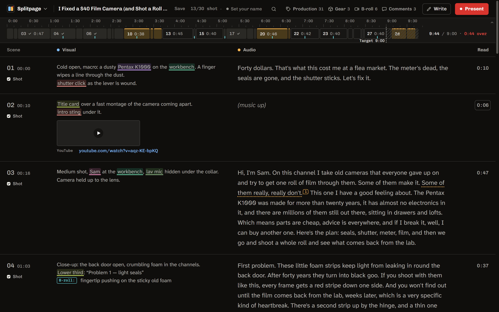
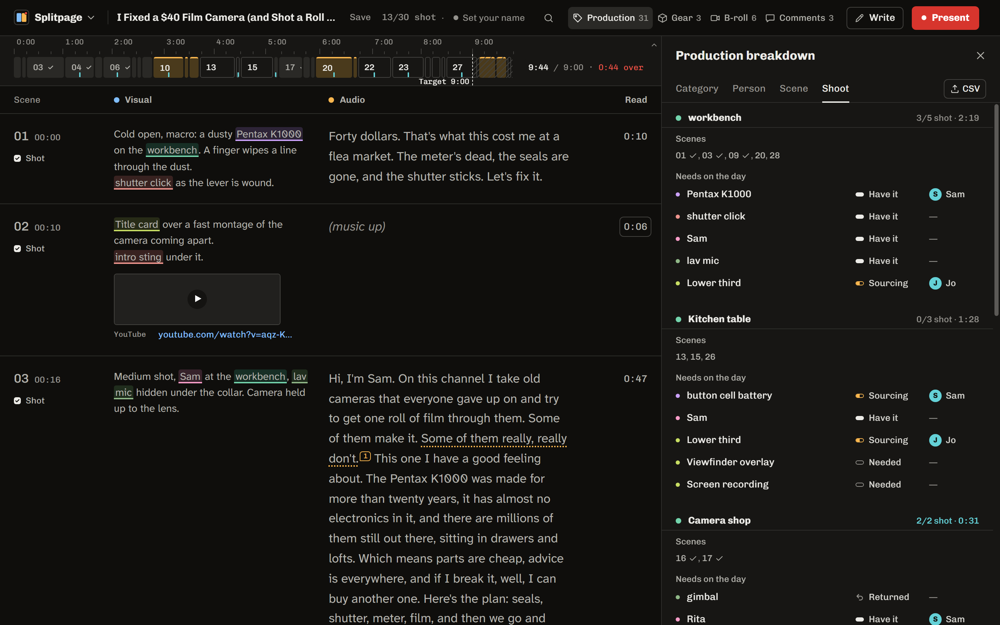
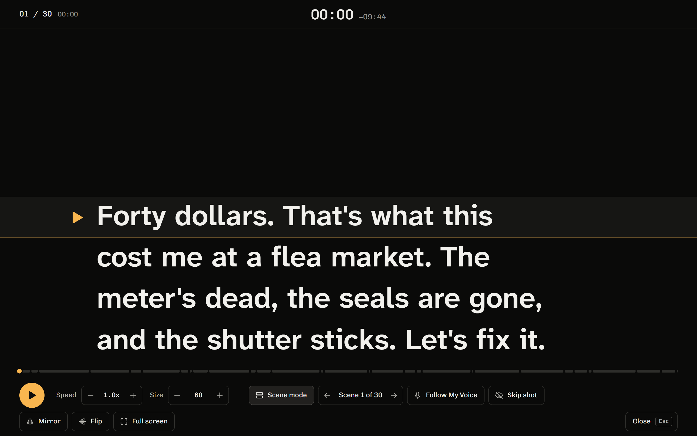
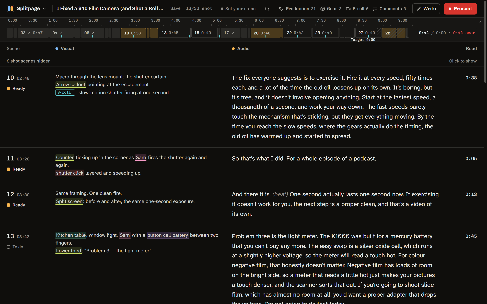
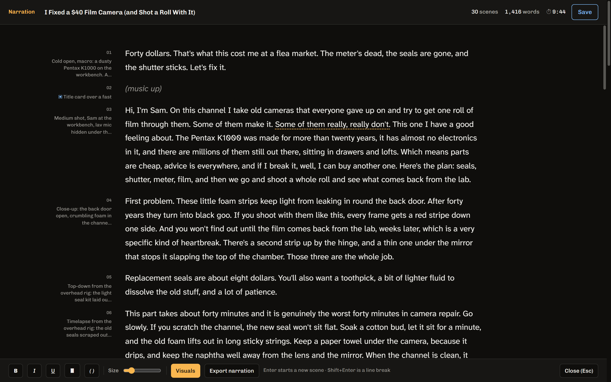
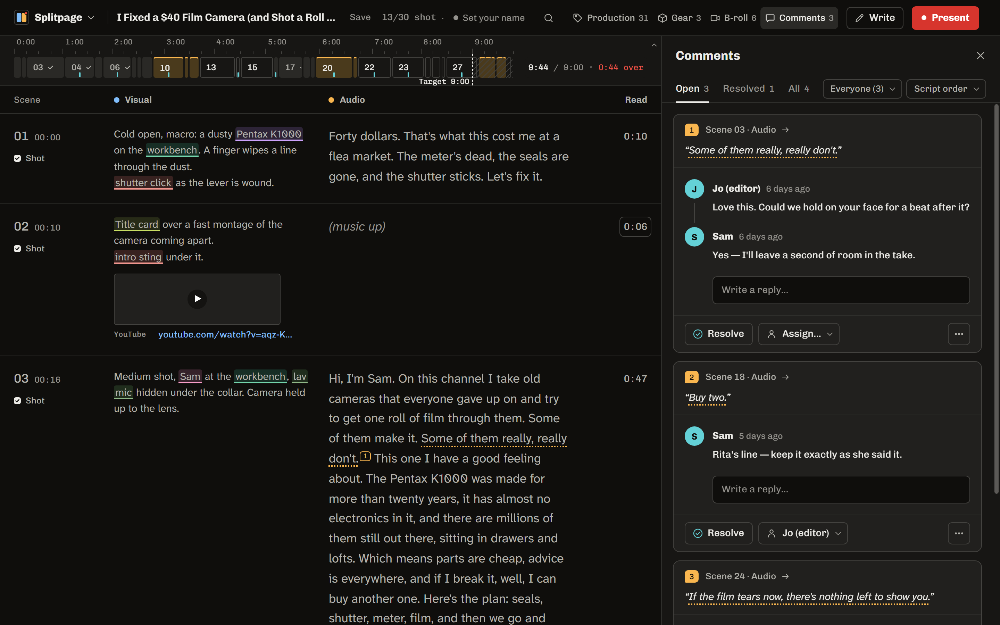
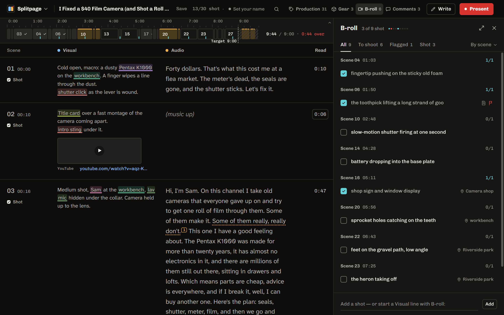
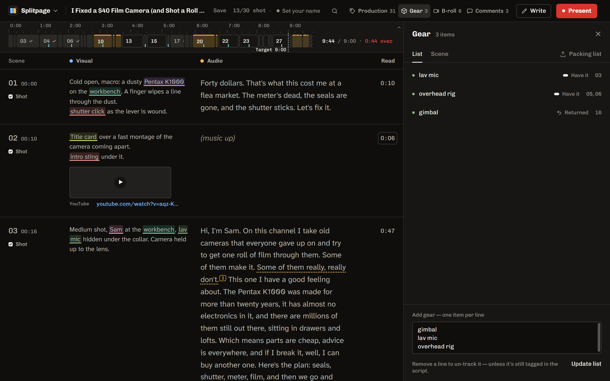

# Splitpage

**The script editor for videos you actually have to shoot.**

Picture on the left, words on the right, and everything the shoot needs is pulled out of the script as you write it. Then you read it off the built-in teleprompter, one scene at a time.

<picture>
  <source media="(prefers-color-scheme: light)" srcset="images/split-view-light.png">
  
</picture>

  <a href="https://github.com/RetroGorilla/splitpage-releases/releases"><b>Download the 3.0 beta</b></a>
  &nbsp;·&nbsp;
  <a href="https://github.com/RetroGorilla/splitpage-releases/releases/latest">Latest stable (2.1)</a>

---

## Why it's different

You've written scripts in a Google Doc, kept your shot list in another doc, tracked props in a spreadsheet, and pasted the narration into a teleprompter app. Splitpage does all of that in one file.

### Tag while you write, get a shot list for free

Type `[gaffer tape]`, `{kitchen}`, `~lens flare~` or `<wireless lav>` and it becomes a tracked prop, location, VFX shot or piece of gear. Or just write it out: `Prop:`, `Loc:`, `VFX:`, `Cast:`, `Gear:`, `SFX:` or `Music:`, then press Tab. Every tag lands in the **Production breakdown** with the scenes it appears in, who's getting it, and how far along it is: *Needed → Sourcing → Have it → Returned*.

Forgot to tag something you already track? Splitpage underlines it and offers to tag it for you. Or search for it and **Tag all as…** to tag every mention at once.

### Plan the shoot day by location

The **Shoot** view regroups your script by where it's filmed. Every scene at one location sits in one block, with everything that has to be there and whether it's in hand yet.

### See the whole video at a glance

The **rundown** under the header shows every scene as a block, sized by how long it runs and lit by its status. Hover it to magnify the scenes under the pointer, click one to jump there, or drop a scene on it to move it. The script's length sits at the end. Set a **target length** and it tells you how far over or under you are.

### A teleprompter built for solo shooters

**Scene mode** cues one scene, plays it, and stops at the end, ready for the next take. Step through takes with ← →. **Follow My Voice** scrolls as you talk. In the Windows app it runs on Windows' own speech recognition, so it works offline. Mirror and flip are there if you use a beam-splitter rig.

Write `((beat))` in the narration and it becomes a stage direction: on the prompter, but never waited for and never counted in the read time. Start an audio line with `SFX:` or `Music:` and it becomes a sound cue, kept off the prompter and listed in the breakdown.

### Pick up where you left off on day two

Click a scene's lamp to mark it *To do → Ready → Shot*. **Hide shot scenes** (Ctrl+Alt+H) collapses everything you've already recorded, the script length shows what's left to read, and the teleprompter can skip shot scenes too.

---

## Also in the box

<table>
<tr>
<td width="50%" valign="top">

**Writer mode.** Just the narration, as one flowing document, with each scene's visual greyed out in the margin. Word count and runtime update as you type. Export the narration as `.docx` for a voice artist.

</td>
<td width="50%" valign="top">

</td>
</tr>
<tr>
<td valign="top">

**Comments that stay put.** Anchored to the exact phrase, with replies, assignees and Open / Resolved filters. Send an editor or client a **review link**: they can read, run the teleprompter and comment, but the server won't let them change a word.

</td>
<td valign="top">

</td>
</tr>
<tr>
<td valign="top">

**A B-roll list built for the shoot.** Start a visual line with `B-roll:` and it's on the list. Tick shots off, flag one for a reshoot, filter to what's left, or open the whole list as one printable page grouped by location.

</td>
<td valign="top">

</td>
</tr>
<tr>
<td valign="top">

**A gear list that isn't in the script.** Nobody writes "wireless lav" into narration. Type your kit into the Gear panel, one item per line, then print a packing list to check off before you leave.

</td>
<td valign="top">

</td>
</tr>
</table>

- **Runtime** per scene and for the whole video, at your own reading speed. Type a scene's length by hand for a montage or a title card.
- **Pictures and video in each scene.** Drop images, video files or YouTube and Vimeo links onto the visual column, then flip through them in the scene's gallery.
- **Whole scenes on the clipboard.** Drag out of a text box to select scenes, then copy, cut or paste them with their comments and pictures, even into another script.
- **One undo for everything**: typing, tags, moved or split scenes, statuses, pictures, comments and breakdown changes.
- **Work with other people** on your network. Edits merge word by word, and a dot on the rundown shows which scene each person is in.
- **Exports** to PDF, Word, Markdown, a spreadsheet, a narration-only file, a CSV breakdown and gear or prop packing lists, all from one Export dialog (Ctrl+E).
- **Search commands** with Ctrl+K, **Settings** in one place, dark and light themes, and **script zoom** with Ctrl + mouse wheel.
- **A start screen** with starter scripts and your recent files, plus a 30-scene demo that uses every feature.
- **Your files, no account.** Scripts save as plain Markdown or a single `.splitpage` file, with autosave and version history built in.

---

## Install

Grab a file from the [releases page](https://github.com/RetroGorilla/splitpage-releases/releases):

| File | For |
| --- | --- |
| `SplitpageDesktopSetup-<version>-x64.exe` | Most Windows PCs (Intel/AMD) |
| `SplitpageDesktopSetup-<version>-arm64.exe` | Windows on ARM (Snapdragon, Surface Pro X) |
| `splitpage-<version>.zip` | Portable, for Windows, macOS and Linux. Unzip and open `index.html`, or run `start.bat` / `./start.sh` to use it offline and install it as an app |

The installer sets Splitpage up for you only, with no administrator needed. It isn't code-signed yet, so Windows SmartScreen will warn on first run: click **More info → Run anyway**. `SHA256SUMS.txt` on each release lets you check the download.

The desktop app tells you when there's a newer release and installs it for you. A portable copy tells you too; unzip the new one over the old folder.

> **3.0 is in beta.** The update check only looks at full releases, so copies on 2.1 aren't offered the beta, and a beta install isn't told about the next beta. Check back here for new ones. When 3.0.0 ships, every beta copy is offered it.

---

This repository only hosts release builds. The source is private.
